\# 🛡️ AI Security Anomaly Detection

An AI-powered cybersecurity analytics solution that detects anomalous login behavior using **Isolation Forest**, generates intelligent incident explanations with **Azure OpenAI**, processes data in **Azure Databricks**, and visualizes insights through an interactive **Power BI Dashboard**.

---

## 📌 Project Overview

Organizations generate thousands of authentication events every day, making it difficult for security teams to manually identify suspicious activities.

This project automates anomaly detection using Machine Learning and enhances security investigations with AI-generated explanations and recommendations.

---

## 🚀 Key Features

- 🔍 Detects anomalous login events using Isolation Forest
- 🤖 Generates AI-powered incident explanations with Azure OpenAI
- 📊 Interactive Power BI dashboard
- ☁️ Cloud-based processing using Azure Databricks
- 📈 Visualizes login trends, severity levels, resources, and countries
- 📝 Provides remediation recommendations for detected incidents

---

# 🏗️ Solution Architecture

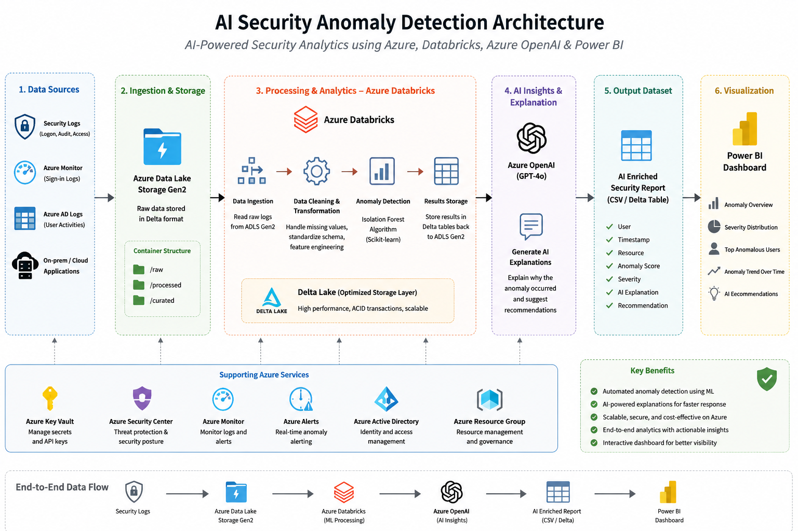

---

# 🔄 Project Workflow

```
Login Dataset
      │
      ▼
Data Preprocessing
      │
      ▼
Feature Engineering
      │
      ▼
Isolation Forest Model
      │
      ▼
Anomaly Detection
      │
      ▼
Azure OpenAI
(AI Explanation Generation)
      │
      ▼
Enhanced Security Dataset
      │
      ▼
Power BI Dashboard
```

---

# 🛠️ Technology Stack

| Category | Technologies |
|----------|--------------|
| Programming | Python |
| Machine Learning | Scikit-learn (Isolation Forest) |
| AI | Azure OpenAI |
| Cloud Platform | Microsoft Azure |
| Data Engineering | Azure Databricks |
| Visualization | Microsoft Power BI |
| Dataset | CSV |
| Version Control | Git & GitHub |

---

# 📂 Repository Structure

```
AI-Security-Anomaly-Detection
│
├── architecture/
├── dashboard/
├── data/
├── docs/
├── notebook/
├── screenshots/
│   └── code/
├── README.md
└── LICENSE
```

---

# 📊 Dashboard Preview

## Complete Dashboard

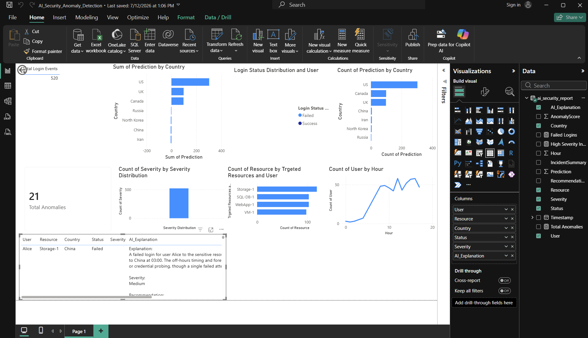

---

## KPI Cards

### Total Login Events

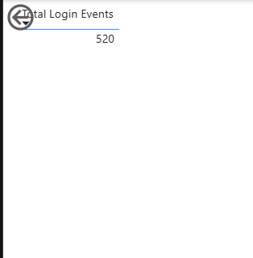

### Total Anomalies

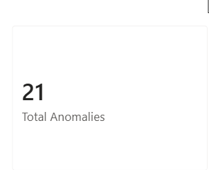

---

## Dashboard Visualizations

### Anomalies by Country

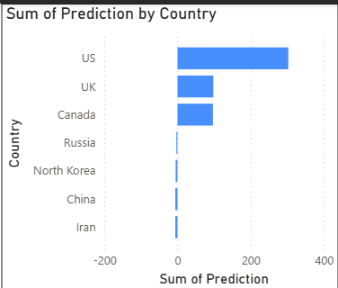

### Login Status Distribution

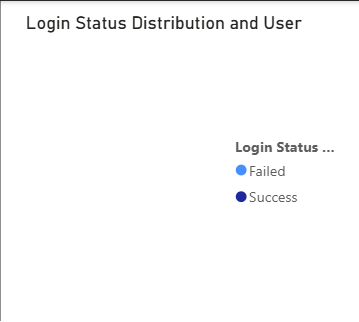

### Severity Distribution

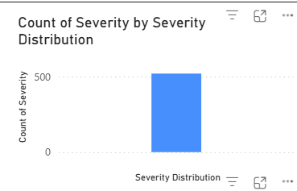

### Targeted Resources

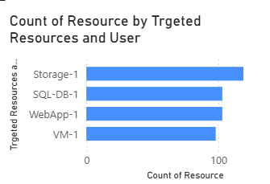

### Hourly Login Trend

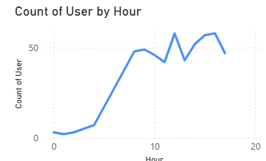

### Prediction by Country

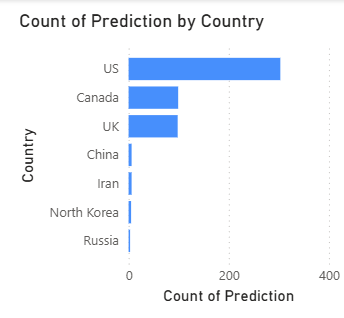

---

# ☁️ Azure Services Used

- Azure Databricks
- Azure OpenAI
- Azure AI Foundry
- Azure Resource Group

---

# 📁 Dataset

The dataset contains simulated security login events including:

- User
- Timestamp
- Country
- Login Status
- Target Resource
- Prediction
- Anomaly Score
- Severity
- AI Explanation
- Recommendation

Dataset Preview:

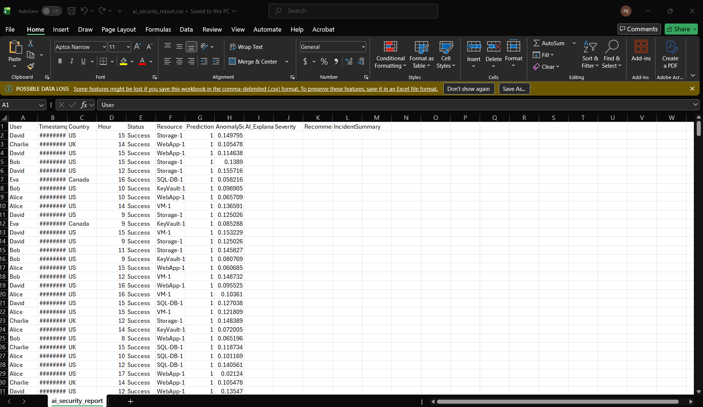

---

# 🧠 Machine Learning Pipeline

1. Data Cleaning
2. Feature Engineering
3. Isolation Forest Training
4. Prediction Generation
5. Anomaly Scoring
6. Severity Classification
7. AI Explanation Generation
8. Power BI Visualization

---

# 📸 Azure Resources

## Azure Resource Group

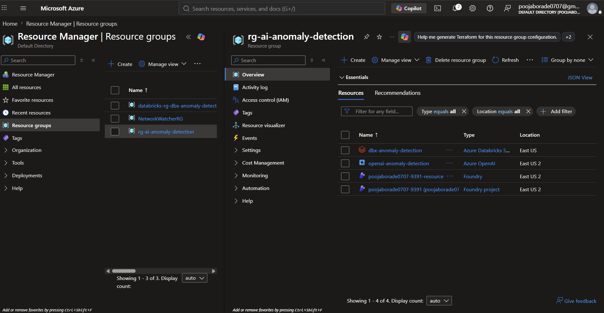

## Azure OpenAI


---

# 🎯 Results

- Automated anomaly detection
- AI-assisted incident analysis
- Interactive Power BI reporting
- Cloud-based scalable architecture
- Reduced manual investigation effort

---

# 🔮 Future Enhancements

- Real-time event streaming
- Microsoft Sentinel integration
- Automated alerting
- Power BI Service deployment
- Model retraining pipeline
- Role-based dashboard access

---

# 👩‍💻 Author

**Pooja Borade**

**Master of Science in Information Technology**

Passionate about building AI-powered, cloud-native, and data-driven solutions using Microsoft Azure, Python, Databricks, and Power BI.

### Areas of Interest
- ☁️ Cloud Computing
- 🤖 Artificial Intelligence
- 📊 Data Analytics
- 📈 Business Intelligence
- 🔒 Cybersecurity
- 🧠 Machine Learning

### Connect with Me

- 💼 LinkedIn: https://www.linkedin.com/in/pooja-madhukar-borade-618618210/
- 💻 GitHub: https://github.com/poojan644
- 📧 Email: poojaborade7022@gmail.com

---

## ⭐ If you found this project useful, consider giving it a star!
